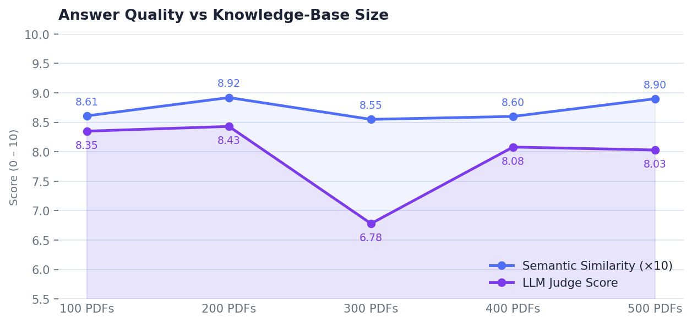
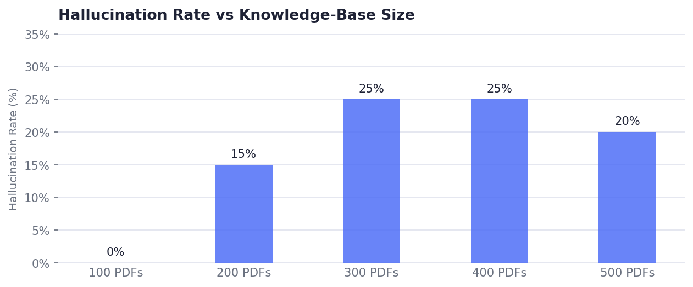

# RAG Agent — PDF Q&A

A Retrieval-Augmented Generation (RAG) backend built with [FastAPI](https://fastapi.tiangolo.com/) and [Mistral AI](https://mistral.ai/), backed entirely by in-process data structures — no external vector database required.

---

## Table of Contents

1. [Architecture Overview](#architecture-overview)
2. [Pipeline Walkthrough](#pipeline-walkthrough)
   - [Data Ingestion](#1-data-ingestion)
   - [Query Processing](#2-query-processing)
   - [Hybrid Search](#3-hybrid-search)
   - [Re-ranking](#4-re-ranking)
   - [Generation](#5-generation)
3. [System Safeguards](#system-safeguards)
   - [Workspace Capacity and Scalability](#1-workspace-capacity-and-scalability)
   - [No External Vector Database](#2-no-external-vector-database)
   - [Insufficient Evidence Guard](#3-insufficient-evidence-guard)
   - [Answer Shaping](#4-answer-shaping)
   - [Hallucination Filter](#5-hallucination-filter)
   - [Query Refusal Policies](#6-query-refusal-policies)
4. [UI](#ui)
5. [API Reference](#api-reference)
6. [Configuration](#configuration)
7. [Running the Project](#running-the-project)
8. [Evaluation](#evaluation)
9. [Libraries & Software](#libraries--software)

---

## Architecture Overview

```
┌─────────────────────────────────────────────────────────────┐
│                        Browser UI                           │
│              (static/index.html — Vanilla JS)               │
└────────────────────────────┬────────────────────────────────┘
                             │ HTTP
┌────────────────────────────▼────────────────────────────────┐
│                    FastAPI Application                       │
│                                                             │
│  POST /api/v1/ingest  ──►  IngestionService                 │
│  GET  /api/v1/ingest  ──►  document registry                │
│  DELETE /api/v1/ingest ──► clear in-memory stores           │
│  POST /api/v1/query   ──►  QueryService                     │
│  GET  /health         ──►  health check                     │
└────────────────────────────┬────────────────────────────────┘
                             │
          ┌──────────────────┴──────────────────┐
          │          In-Memory Stores           │
          │  vector_store: dict[chunk_id →      │
          │    {chunk: DocumentChunk,           │
          │     embedding: list[float]}]        │
          │  bm25_index:  dict[chunk_id →       │
          │    list[str]]  (token list)         │
          └──────────────────┬──────────────────┘
                             │
          ┌──────────────────▼──────────────────┐
          │           Mistral AI API            │
          │  • mistral-embed  (embeddings)      │
          │  • mistral-small  (chat/rerank/      │
          │    intent/evidence check)           │
          └─────────────────────────────────────┘
```

All in-memory stores are initialised at server startup via FastAPI's `lifespan` hook and survive for the lifetime of the process. A `DELETE /api/v1/ingest` call wipes them to start a fresh session.

---

## Pipeline Walkthrough

### 1. Data Ingestion

`POST /api/v1/ingest` accepts one or more PDF files as `multipart/form-data`.

Text is extracted page-by-page using [pdfplumber](https://github.com/jsvine/pdfplumber) as the primary parser, with [pypdf](https://github.com/py-pdf/pypdf) as an automatic fallback for PDFs where pdfplumber yields little usable text. Each page is then split into fixed-size overlapping windows, with boundaries nudged to the nearest sentence break to avoid mid-sentence cuts. Every chunk records its source page number for accurate citations later in the pipeline.

Chunks are embedded in batches using Mistral's `mistral-embed` model. Each chunk's text is prefixed with the document's filename as a label, helping the embedding model distinguish documents with similar body text. Embeddings are stored in a plain in-memory dict alongside a parallel BM25 token index for keyword search.

### 2. Query Processing

`POST /api/v1/query` runs the following sequence of steps:

```
Refusal check → Intent detection → Query transformation
    → Hybrid search → Evidence threshold → Re-ranking
    → Generation → Hallucination filter
```

**Refusal check** runs before any LLM call. Word-boundary regex patterns detect PII, legal, and medical content and short-circuit the pipeline immediately with a category-specific message.

**Intent detection** classifies the query as `SEARCH` or `CHITCHAT` via a Mistral chat call. Obvious greetings are caught by a local heuristic first to avoid an unnecessary API round-trip. Chitchat queries receive a friendly reply with no knowledge-base lookup.

**Query transformation** rewrites the user's question into a short, standalone retrieval phrase — removing filler words and resolving pronouns — while preserving the original phrasing for answer-shape detection downstream.

### 3. Hybrid Search

The rewritten query is scored against all indexed chunks using a weighted sum of two signals:

```
hybrid_score = 0.7 × cosine_similarity + 0.3 × BM25
```

Semantic search captures paraphrase and synonyms but struggles with rare proper nouns or exact quoted phrases; BM25 is the inverse. The hybrid fusion benefits from the strengths of both. Cosine similarity is computed via a single NumPy BLAS matrix-vector multiply rather than individual dot products, giving a significant speedup over large indexes.

### 4. Re-ranking

Hybrid search prioritises recall over precision, so the top candidates are re-ranked by a Mistral chat call that scores each retrieved passage 0–10 for relevance to the original query. Candidates are then re-sorted by that score before the top `top_k` are forwarded to generation. If the LLM call fails, the original hybrid order is preserved.

### 5. Generation

The top-`k` re-ranked chunks are assembled into a sourced context block and sent to Mistral with a **format-aware prompt**. Before the LLM call, a zero-latency regex classifier detects the structural intent of the original query — such as a list, table, comparison, definition, or step-by-step instruction — and selects the corresponding prompt template. Queries that match none of these patterns default to free-form cited prose.

---

## System Safeguards

### 1. Workspace Capacity and Scalability

Each ingest request is bounded by a configurable per-request file count and per-file size limit. Across the session, total chunk usage is tracked against a ceiling — requests that would exceed it are rejected with a usage message. Setting the ceiling to `0` disables it for bulk runs. The in-process vector store scales comfortably to hundreds of thousands of chunks via a NumPy BLAS matrix multiply; beyond that, it can be swapped for [FAISS](https://github.com/facebookresearch/faiss) without changing any other part of the pipeline.

### 2. No External Vector Database


The entire knowledge base lives in two plain Python dicts held in `app.state` — no Redis, Pinecone, Qdrant, or FAISS dependency. For large indexes this in-process approach remains performant thanks to the NumPy BLAS matrix multiply for semantic search. A production path to horizontal scaling would swap the dict-based store for [FAISS](https://github.com/facebookresearch/faiss) without changing any other part of the pipeline.

### 3. Insufficient Evidence Guard

Before generating any answer, the pipeline checks the maximum hybrid score across all retrieved candidates. If no chunk clears the configured similarity threshold, the query is refused with an "insufficient evidence" message rather than risking a hallucinated answer synthesised from weakly related context.

### 4. Answer Shaping

Structural keywords in the original query (e.g. "list", "compare", "how to") are matched by a zero-latency regex classifier before any LLM call, selecting a format-aware prompt template that steers the model toward the output type the user implicitly requested — bulleted list, comparison table, numbered steps, or free-form prose.

### 5. Hallucination Filter

After the answer is generated, a post-hoc evidence check extracts each verifiable claim, sends them to Mistral alongside the retrieved source passages, and removes any claim classified as `UNSUPPORTED`. A `> Evidence check: N claim(s) removed` footnote is appended and the `hallucination_warning` flag in the response is set to `true` when this occurs.

### 6. Query Refusal Policies

Word-boundary regex patterns detect three categories of sensitive content — PII (e.g. personal identifiers), legal (e.g. contracts, liability), and medical (e.g. symptoms, diagnosis) — before any LLM or search call is made. A matched query is immediately refused with a category-specific message, and the frontend renders it as a distinct amber warning banner rather than a normal answer.

---

## UI

A single-page chat interface is served from `static/index.html` at the application root (`GET /`). It is pure HTML + CSS + Vanilla JS — no framework or build step required.

### Workspace Management

The upload panel enforces server-side constraints on the client before any network call: files are rejected immediately if they are not PDFs or exceed the per-file size limit synced from the backend at load time. A collapsible *Knowledge Base* panel lists every indexed file with its relative upload time, and a colour-coded capacity bar (green → amber at 80% → red at 100%) shows how much of the session's indexing budget is in use. A *Clear Session* button wipes the entire knowledge base, with a confirmation hint warning that the action is irreversible.

### Query Experience

The query panel renders LLM answers as styled markdown via [marked.js](https://marked.js.org/), including tables, code blocks, and bulleted lists. Cited sources appear below the answer as filename-and-page chips. An *Advanced Settings* disclosure exposes a top-k slider (1–20 sources) so users can trade answer depth for speed. Sensitive-query refusals are surfaced as a distinct amber banner labelled by category (Privacy / Legal / Medical) rather than blending into the normal answer area.

---

## API Reference

| Method | Path | Description |
|---|---|---|
| `GET` | `/health` | Returns app version and count of indexed documents |
| `POST` | `/api/v1/ingest` | Upload one or more PDFs; returns chunk counts and workspace usage |
| `GET` | `/api/v1/ingest` | List all indexed documents with metadata and workspace stats |
| `DELETE` | `/api/v1/ingest` | Wipe the entire in-memory knowledge base |
| `POST` | `/api/v1/query` | Submit a natural-language query; returns answer, sources, and diagnostic flags |

Full interactive documentation is available at `http://localhost:8000/docs` (Swagger UI) and `http://localhost:8000/redoc` (ReDoc) when the server is running.

---

## Running the Project

**Prerequisites:** Python 3.11+, a [Mistral API key](https://console.mistral.ai/).

```bash
# 1. Clone and enter the repo
git clone <repo-url>
cd stack_ai_technical

# 2. Create and activate a virtual environment
python -m venv .venv
source .venv/bin/activate        # Windows: .venv\Scripts\activate

# 3. Install dependencies
pip install -r requirements.txt

# 4. Configure environment — create a .env file and set your key
echo "MISTRAL_API_KEY=<your-key>" > .env

# 5. Start the server
uvicorn app.main:app --reload --host 0.0.0.0 --port 8000
```

Open `http://localhost:8000` for the chat UI, or `http://localhost:8000/docs` for the API explorer.

---

## Evaluation

`scripts/eval.py` provides an end-to-end benchmark harness:

1. Clears the knowledge base, then ingests a directory of PDFs in configurable batches.
2. Runs every query from a CSV file (`query`, `answer`, `pdf_filename` columns) through `POST /api/v1/query`.
3. Scores each response with:
   - **Semantic similarity** — cosine similarity between Mistral embeddings of the ground-truth answer and the agent answer.
   - **LLM-as-judge** — Mistral scores the agent answer 0–10 against the ground truth.
4. Writes a results CSV and prints a summary (avg semantic sim, avg judge score, hallucination flag count).

```bash
python scripts/eval.py \
  --api_key <mistral-key> \
  --top_k 5
```

Configure `PDFS_DIR`, `EVAL_CSV`, and `RESULTS_FILE` at the top of the script to point at your dataset.

### Dataset

Evaluation data is drawn from [Open RAG Bench](https://github.com/vectara/open-rag-bench), an open-source multimodal benchmark created by [Vectara](https://huggingface.co/datasets/vectara/open_ragbench) — one of the few public datasets for RAG systems that starts from raw PDFs. The original dataset contains ~400 Arxiv articles paired with 3 000 query/answer pairs. An additional ~600 distractor PDFs (with no associated queries) were added to test retrieval precision under a noisier knowledge base. All files are available on [Google Drive](https://drive.google.com/drive/u/0/folders/18q_zokgsrMsL-Xfx4OcYST1DLb8TNzYY).

**Generating a sample** — after downloading the files from Google Drive, use `scripts/eval_sampling.py` to randomly sample a subset of PDFs and their associated queries:

```bash
# Sample 500 PDFs and 20 queries (defaults)
python scripts/eval_sampling.py

# Custom sample sizes
python scripts/eval_sampling.py --n_pdfs 800 --n_queries 50
```

This copies the sampled PDFs into a new folder (`pdfs_sample_<N>`) and writes a filtered query CSV (`<N>_random.csv`), both ready to pass directly to `scripts/eval.py`.

### Results

Each run evaluates 20 randomly sampled queries against knowledge bases of increasing size (100–500 PDFs). Semantic similarity is measured as cosine similarity between Mistral embeddings of the ground-truth and agent answers (0–1). LLM judge score is assigned by Mistral on a 0–10 scale. Semantic similarity is scaled ×10 in the chart below to share the same axis with the judge score.





| Knowledge Base | Semantic Similarity | LLM Judge Score | Hallucination Rate |
|---|---|---|---|
| 100 PDFs | 0.8611 | 8.35 / 10 | 0% |
| 200 PDFs | 0.8915 | 8.43 / 10 | 15% |
| 300 PDFs | 0.8554 | 6.78 / 10 | 25% |
| 400 PDFs | 0.8602 | 8.08 / 10 | 25% |
| 500 PDFs | 0.8901 | 8.03 / 10 | 20% |
| **Average** | **0.8717** | **7.93 / 10** | **17%** |

Semantic similarity is stable across all runs (0.855–0.892), suggesting retrieval and embedding quality is robust to knowledge-base size. The LLM judge score dips at 300 PDFs (6.78) before recovering, likely reflecting a harder query sample rather than a structural degradation in retrieval. Insufficient-evidence refusals were zero across all runs, indicating the index consistently surfaced at least one relevant chunk for every query tested.

### Limitations

- **Small query sample.** Each run evaluates only 20 queries, which may not be enough to produce statistically stable scores — a single unusually hard or easy question can noticeably shift the averages. Increasing the sample queries per run would reduce variance and give a more reliable picture of how retrieval quality changes as the knowledge base grows.

- **Sampling bias.** The 20 queries are drawn at random from a larger query bank, so there is no guarantee they are uniformly distributed across the ingested PDFs. Some PDFs may be tested multiple times while others are never queried, meaning the scores reflect the difficulty of that particular sample rather than the pipeline's performance across the full corpus.

- **Scalability not yet stress-tested.** Scores remain stable up to 500 PDFs with no noticeable degradation in semantic similarity or judge score, which is encouraging. However, it is not yet clear where the pipeline's retrieval quality starts to decline — if at all — as the knowledge base grows further. Extending the evaluation to 1 000 PDFs would help establish whether the in-process vector store and hybrid search remain effective at larger scale, or whether an approximate nearest-neighbour index becomes necessary.

---

## Libraries & Software

| Library | Version | Role |
|---|---|---|
| [FastAPI](https://fastapi.tiangolo.com/) | ≥ 0.111 | Web framework, dependency injection, automatic OpenAPI docs |
| [Uvicorn](https://www.uvicorn.org/) | ≥ 0.29 | ASGI server |
| [Pydantic](https://docs.pydantic.dev/) | ≥ 2.7 | Request/response validation and serialisation |
| [pydantic-settings](https://docs.pydantic.dev/latest/concepts/pydantic_settings/) | ≥ 2.2 | `.env`-based settings management |
| [pdfplumber](https://github.com/jsvine/pdfplumber) | ≥ 0.11 | Primary PDF text extraction (robust font/layout handling) |
| [pypdf](https://github.com/py-pdf/pypdf) | ≥ 4.2 | Fallback PDF text extraction |
| [mistralai](https://github.com/mistralai/client-python) | ≥ 1.0 | Mistral AI Python SDK (embeddings + chat completions) |
| [NumPy](https://numpy.org/) | ≥ 1.26 | Vectorised cosine similarity (BLAS matrix-vector multiply) |
| [httpx](https://www.python-httpx.org/) | ≥ 0.27 | Async HTTP client used in the eval harness |
| [python-multipart](https://github.com/Kludex/python-multipart) | ≥ 0.0.9 | Multipart form parsing for file uploads |
| [marked.js](https://marked.js.org/) | 9 (CDN) | Markdown → HTML rendering in the browser UI |
